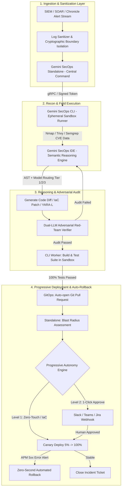

# BẢN ĐẶC TẢ & KẾ HOẠCH TRIỂN KHAI KỸ THUẬT: NỀN TẢNG TÁC CHIẾN BẢO MẬT TỰ HÀNH (AUTONOMOUS SECOPS PLATFORM)
**Mã dự án:** `ASQ-Engine` | **Phiên bản:** `V4 Enterprise-Grade (Quartet Closed-Loop Architecture)`  
**Thư mục dự án:** `d:\du an GGS`

---

## 1. TỔNG QUAN KIẾN TRÚC HỆ SINH THÁI BỘ TỨ (QUARTET ARCHITECTURE)

Hệ thống được thiết kế theo mô hình điều phối phân tán có cấu trúc kiểm soát tập trung (**Hub-and-Spoke with Programmatic Fabric**), bao gồm 4 trụ cột chính và các chốt chặn Zero-Trust Guardrails:



---

## 2. CHI TIẾT 4 TRỤ CỘT CỐT LÕI (THE 4 PILLARS)

### 2.1. Gemini SecOps Standalone (Ban Chỉ huy Vĩ mô - Central Command)
* **Bản chất:** Nguồn chân lý duy nhất (Single Source of Truth) và trạm kiểm soát chiến lược toàn cục.
* **Chức năng kỹ thuật:**
  * Tiếp nhận và chuẩn hóa các luồng sự kiện bảo mật (Security Event Streams) thời gian thực từ SIEM/SOAR/Chronicle.
  * Đánh giá mức độ ảnh hưởng hạ tầng diện rộng (**Blast Radius Assessment**) trước khi phê duyệt bất kỳ hành động vá lỗi nào.
  * Quản trị tập trung hạn ngạch Token (TPM/RPM), phân bổ tài nguyên và giữ chốt chặn an toàn tối cao (**Emergency Kill-Switch**) để thu hồi phiên làm việc của toàn bộ Agent khi phát hiện dị thường.
  * Điều phối mức độ tự hành (**Progressive Autonomy Controller: Level 1, 2, 3**).

### 2.2. Gemini SecOps IDE (Bộ não Phân tích Vi mô & Suy luận R&D)
* **Bản chất:** Động cơ xử lý ngôn ngữ và phân tích cấu trúc mã nguồn sâu (Semantic & AST Reasoning Engine).
* **Chức năng kỹ thuật:**
  * Soi cây cú pháp trừu tượng (AST) của mã nguồn và các tệp cấu hình hạ tầng dạng mã (IaC: Terraform, Kubernetes Manifests, Helm Charts) để định vị nguyên nhân gốc rễ (Root Cause).
  * Điều phối thông minh 3 tầng mô hình (**Model Tiering Router**).
  * Tự động sinh mã vá lỗi (**Remediation Diff**) và các tập luật phát hiện mối đe dọa (**YARA-L Rules**).
  * Tích hợp **Dual-LLM Adversarial Red-Team Verifier** để phản biện độc lập bản vá trước khi thử nghiệm.

### 2.3. Gemini SecOps CLI (Đội Thi công Thực địa - Sandboxed Runtime Worker)
* **Bản chất:** Agent thực thi dòng lệnh cô lập bên trong mạng nội bộ (Internal VPC/Private Network).
* **Chức năng kỹ thuật:**
  * **Ephemeral Container Execution:** Mọi thao tác đều được khởi chạy trong container tạm thời (Docker/Podman), tự động tiêu hủy ngay sau khi tác vụ hoàn thành để tránh tồn lưu mã độc.
  * **Trinh sát & Rà quét mạng:** Tự động thực thi các công cụ phân tích bảo mật (`nmap`, `trivy`, `semgrep`) đối với các tài nguyên mạng nội bộ mà bên ngoài không thể chạm tới.
  * **Build & Verification:** Nạp bản vá vào môi trường sandbox, chạy kiểm tra cú pháp (linter), biên dịch và thực thi toàn bộ bài kiểm thử tự động (Unit/Integration Tests).
  * **GitOps Integration:** Đóng gói kết quả kiểm thử đạt chuẩn và tự động mở Git Pull Request về repository nội bộ.

### 2.4. Antigravity SDK & Guardrails (Hệ thống Mạch máu & An toàn Zero-Trust)
* **Bản chất:** Bộ thư viện và lớp chốt chặn an ninh bảo vệ toàn diện hệ thống.
* **Chức năng kỹ thuật:**
  * **Cryptographic Token Verification:** Giao tiếp qua kênh bảo mật gRPC/mTLS có ký số xác thực (HMAC-SHA256/Ed25519) và tuân thủ phân quyền truy cập theo vai trò (RBAC).
  * **Log Sanitizer:** Khử độc toàn bộ log SIEM, triệt tiêu 100% nguy cơ **Indirect Prompt Injection**.
  * **FinOps Guardrails 2 Lớp:** Thuật toán Token Bucket quản lý RPM tức thời và ngân sách 5 giờ có cơ chế tự động Fallback từ model Pro về Flash/Flash-Lite.
  * **Canary & Auto-Rollback Guard:** Giám sát APM metric khi deploy Production, kích hoạt rollback tức thì nếu phát hiện tỷ lệ lỗi tăng đột biến.

---

## 3. MA TRẬN PHÂN TẦNG MÔ HÌNH TÁC CHIẾN (MODEL TIERING MATRIX)

| Tầng xử lý | Mô hình phụ trách | Nhiệm vụ kỹ thuật | Đầu ra kỹ thuật (Artifacts) |
| :--- | :--- | :--- | :--- |
| **Tier 1: Triage & Lọc ồn** | Gemini Flash-Lite / Small SLM | Xử lý log dung lượng lớn, quét cổng thông thường, ping sweep, chuẩn hóa UDM. | Tự động đóng cảnh báo rác (False Positive) hoặc mở Ticket sơ bộ. |
| **Tier 2: Điều tra & Phản ứng** | Gemini Flash / Sec-Tuned Model | Xử lý sự cố Medium (brute force, vi phạm policy), tra cứu IoC/Mandiant, kích hoạt Playbook. | YARA-L rules, Threat Intelligence Summary. |
| **Tier 3: Đại án APT & IaC** | Gemini Pro / Reasoning Model | Phân tích tấn công đa chặng (APT), leo thang đặc quyền, phân tích tệp IaC phức tạp, tính toán Blast Radius. | Remediation Proposal, Infrastructure Patch Diff. |

---

## 4. CHU TRÌNH TỰ CHỮA LÀNH KHÉP KÍN (5-STEP CLOSED-LOOP FLOW)

1. **Bước 1 (Phát hiện & Khử độc):** Standalone nhận diện cảnh báo từ SIEM $\rightarrow$ Log Sanitizer làm sạch $\rightarrow$ dùng SDK phát lệnh có ký số xuống CLI Runner.
2. **Bước 2 (Trinh sát thực địa):** CLI Runner khởi tạo ephemeral container, quét Nmap / Trivy / Semgrep $\rightarrow$ gửi dữ liệu về IDE.
3. **Bước 3 (Phân tích, Sinh bản vá & Red-Team Audit):** IDE phân tích AST, sinh Code Diff, nạp qua Dual-LLM Red-Team Agent để phản biện độc lập.
4. **Bước 4 (Thực thi kiểm thử trong Sandbox):** IDE điều động CLI nạp code vá vào container cô lập, chạy linter, compile và test suite $\rightarrow$ Tự động mở Git Pull Request khi toàn bộ bài test vượt qua.
5. **Bước 5 (Thẩm định, Progressive Deploy & Tự phục hồi):** Standalone phân tích Blast Radius $\rightarrow$ kích hoạt quy trình Canary Rolling Update (Level 1 Auto / Level 2 1-Click Approve). Nếu phát sinh lỗi $\rightarrow$ kích hoạt **Zero-Second Automated Rollback**.

---

## 5. CẤU TRÚC THƯ MỤC SOURCE CODE TẠI `d:\du an GGS`

```
d:\du an GGS/
├── IMPLEMENTATION_PLAN.md          # Bản đặc tả kỹ thuật chi tiết (File này)
├── package.json                    # Cấu hình Root Monorepo Workspaces
├── tsconfig.json                   # Cấu hình TypeScript toàn cục
├── packages/
│   ├── sdk/                        # Core SDK, Types, Token Signer, Event Bus
│   │   ├── package.json
│   │   └── src/
│   │       ├── types/index.ts
│   │       ├── security/token-signer.ts
│   │       ├── transport/event-bus.ts
│   │       └── index.ts
│   └── guardrails/                 # Chốt chặn An toàn, FinOps & Red-Team
│       ├── package.json
│       └── src/
│           ├── sanitizer/log-sanitizer.ts
│           ├── finops/token-bucket.ts
│           ├── adversarial/red-team-verifier.ts
│           ├── canary/rollback-guard.ts
│           └── index.ts
├── services/
│   ├── standalone/                 # Central Command & Blast Radius
│   │   ├── package.json
│   │   └── src/
│   ├── ide-reasoning/              # AST & AI Reasoning Engine
│   │   ├── package.json
│   │   └── src/
│   │       ├── router/model-router.ts
│   │       ├── ast/ast-parser.ts
│   │       ├── remediation/patch-generator.ts
│   │       └── engine.ts
│   └── cli-worker/                 # Ephemeral Docker Sandbox & Scanners
│       ├── package.json
│       └── src/
│           ├── sandbox/ephemeral-runner.ts
│           ├── scanners/network-recon.ts
│           ├── scanners/sast-scanner.ts
│           ├── gitops/pr-dispatcher.ts
│           └── worker.ts
└── tests/
    └── e2e/                        # Kịch bản kiểm thử tích hợp 5 bước khép kín
```
