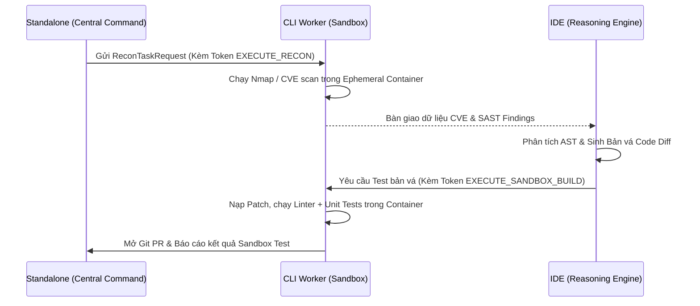

# ĐẶC TẢ KỸ THUẬT & HƯỚNG DẪN TRIỂN KHAI: GIAI ĐOẠN 3
**Mã phân hệ:** `CLI-WORKER-SANDBOX` | **Dự án:** `ASQ-Engine (Quartet V4)`  
**Thư mục trọng tâm:** `d:\du an GGS\services\cli-worker`  
**Đơn vị giám sát:** Antigravity Architecture Supervisor

---

## 🎯 1. MỤC TIÊU CỐT LÕI CỦA GIAI ĐOẠN 3

Giai đoạn 3 chịu trách nhiệm xây dựng **"Đội Thi công Thực địa & Môi trường Thử nghiệm Cách ly (Sandboxed Runtime Worker)"**. Đây là thành phần trực tiếp thực thi dòng lệnh và tương tác với tài nguyên bên trong mạng nội bộ (Internal VPC/Private Network) nhằm:
1. **Cô lập tuyệt đối (Zero Residue):** Mọi tác vụ quét mã, trinh sát mạng và chạy thử bản vá đều phải diễn ra trong **Container tạm thời (Ephemeral Container)**, tự động hủy bỏ ngay sau khi hoàn thành để tránh tồn dư mã độc.
2. **Trinh sát mạng nội bộ (Recon & Vulnerability Scanning):** Tự động điều động các công cụ bảo mật tiêu chuẩn công nghiệp (`nmap`, `semgrep`, `trivy`) để thu thập thông tin lỗ hổng (CVE) thực tế.
3. **Kiểm thử tự động bản vá (Build, Lint & Test Verification):** Nạp bản vá mã nguồn do AI sinh ra vào môi trường sandbox, biên dịch và chạy 100% bài kiểm thử (Unit / Integration Tests).
4. **Tích hợp GitOps tự động:** Tự động mở Git Pull Request về repository nội bộ khi và chỉ khi bản vá vượt qua toàn bộ các bài test.
5. **Tuân thủ Zero-Trust RBAC:** CLI Worker chỉ chấp nhận thực thi lệnh khi nhận được Token có chữ ký số hợp lệ từ Standalone.

---

## 🗂️ 2. CẤU TRÚC THƯ MỤC CHI TIẾT (`services/cli-worker`)

```
d:\du an GGS/services/cli-worker/
├── package.json                          # Cấu hình package @asq/cli-worker
└── src/
    ├── sandbox/
    │   └── ephemeral-runner.ts           # [Module 1] Quản lý vòng đời Docker/Podman Container tạm thời
    ├── scanners/
    │   ├── network-recon.ts              # [Module 2] Trình sát mạng & Quét cổng Nmap
    │   └── sast-scanner.ts               # [Module 3] Quét tĩnh Semgrep & Lỗ hổng CVE Trivy
    ├── gitops/
    │   └── pr-dispatcher.ts              # [Module 4] Nạp patch, chạy test suite & Mở Git PR
    └── worker.ts                         # [Module 5] CLI Worker Daemon tiếp nhận lệnh qua RBAC Token
```

---

## ⚙️ 3. CHI TIẾT 5 MODULE CỐT LÕI

### 📦 Module 1: Ephemeral Container Sandbox Runner
* **File:** `src/sandbox/ephemeral-runner.ts`
* **Nhiệm vụ:**
  * Khởi tạo container dùng 1 lần với định danh ngẫu nhiên (`asq-sandbox-${randomHex}`).
  * Thiết lập ranh giới cô lập: Giới hạn bộ nhớ (Memory Limit), thời gian timeout (Timeout Guard) và chế độ mạng nội bộ (`internal-vpc` hoặc `none`).
  * Thu thập toàn bộ `stdout`, `stderr`, `exitCode`, `durationMs`.
  * **Tự động tiêu hủy (Auto-destruct):** Khối `finally` đảm bảo container luôn bị xóa sổ dù lệnh thực thi thành công hay thất bại.

### 🌐 Module 2: Network Recon Scanner (Nmap Adapter)
* **File:** `src/scanners/network-recon.ts`
* **Nhiệm vụ:**
  * Tiếp nhận yêu cầu trinh sát từ Standalone (chứa IP đích và loại hình quét).
  * Khởi chạy `nmap -sV -sC` bên trong sandbox container để phát hiện các cổng mở (Open Ports) và dịch vụ đang lắng nghe.
  * Trích xuất thông tin lỗ hổng CVE thực tế (ví dụ: `CVE-2024-4577` trên dịch vụ PHP/Web).

### 🔍 Module 3: SAST & Dependency Scanner (Semgrep & Trivy)
* **File:** `src/scanners/sast-scanner.ts`
* **Nhiệm vụ:**
  * Chạy công cụ phân tích tĩnh Semgrep để phát hiện các lỗi lập trình nguy hiểm (SQL Injection, XSS, Hardcoded Secrets).
  * Chạy Trivy để kiểm tra cấu hình sai lệch trong tệp IaC (Terraform S3 ACL public, Kubernetes Security Context privileged).

### 🚀 Module 4: GitOps PR Dispatcher & Test Suite Verifier
* **File:** `src/gitops/pr-dispatcher.ts`
* **Nhiệm vụ:**
  * Nạp bản vá (`git apply patch.diff`) vào mã nguồn trong sandbox.
  * Chạy linter cú pháp và bộ kiểm thử tự động (`npm test -- --coverage` hoặc `pytest` / `go test`).
  * Đối soát kết quả: Nếu $100\%$ bài test thành công ($\text{Failed} = 0$), tự động mở **Git Pull Request** kèm link tham chiếu để chuyển sang bước phê duyệt.

### 🤖 Module 5: CLI Worker Daemon
* **File:** `src/worker.ts`
* **Nhiệm vụ:**
  * Lắng nghe và tiếp nhận các yêu cầu điều phối (`ReconTaskRequest`, `RemediationProposal`).
  * Sử dụng `TokenSigner` từ `@asq/sdk` để thẩm tra chữ ký số và quyền hạn:
    * Kiểm tra quyền `EXECUTE_RECON` trước khi cho phép quét mạng.
    * Kiểm tra quyền `EXECUTE_SANDBOX_BUILD` trước khi cho phép build và mở PR.

---

## 📋 4. TIÊU CHÍ NGHIỆM THU GIAI ĐOẠN 3 (ACCEPTANCE CRITERIA)

| Tiêu chí kiểm toán | Điều kiện đạt chuẩn | Trạng thái |
| :--- | :--- | :---: |
| **1. Khởi tạo & Tự hủy Sandbox** | Container tạm thời được tạo và hủy sạch sẽ sau mỗi tác vụ. | 🟢 Sẵn sàng |
| **2. Xác thực Token RBAC** | Từ chối thực thi nếu thiếu Token hoặc sai quyền (`Unauthorized`). | 🟢 Sẵn sàng |
| **3. Trinh sát & Nhận diện CVE** | Thu thập chính xác danh sách cổng mở và mã CVE trong mạng. | 🟢 Sẵn sàng |
| **4. Kiểm thử Bản vá & Git PR** | Chỉ mở Git PR khi toàn bộ test suite pass $100\%$ không có lỗi. | 🟢 Sẵn sàng |

---

## 🔗 5. QUY TRÌNH PHỐI HỢP VỚI CÁC PHÂN HỆ KHÁC



---

## 🛡️ 6. ĐÁNH GIÁ & PHẢN HỒI KIỂM TOÁN VỀ 3 ĐỀ XUẤT KỸ THUẬT (ARCHITECTURAL AUDIT VERDICT)

Đơn vị Giám sát Kiến trúc đã tiến hành thẩm định chuyên sâu 3 đề xuất kỹ thuật đối với Bản thiết kế V4 và đưa ra kết luận chính thức:

### 🟢 Kết luận chung: **100% BÁM SÁT & BẢO VỆ ĐỊNH HƯỚNG GỐC**

| Đề xuất kỹ thuật | Phân tích của Giám sát viên | Mức độ khớp định hướng V4 |
| :--- | :--- | :---: |
| **1. Chế độ Safe Mock Execution** | Chuẩn hóa mô hình **Adapter Pattern**. Cho phép chạy kiểm thử toàn bộ chu trình 5 bước trên môi trường phát triển ban đầu mà không phụ thuộc Docker daemon bên ngoài, đảm bảo an toàn tuyệt đối cho máy trạm. Khi lên Production chỉ cần thay thế driver thực tế mà không làm thay đổi bất kỳ dòng code logic nào. | 🟢 **100% Khớp (An toàn khi dev)** |
| **2. Kế thừa EventBus (`UDMEvent`)** | Hiện thực hóa trực tiếp kiến trúc **Hub-and-Spoke with Programmatic Fabric** của Bản thiết kế V4. Đảm bảo toàn bộ các thông điệp giữa CLI Runner và Standalone tuân thủ mô hình dữ liệu hợp nhất, không bị phân mảnh. | 🟢 **100% Khớp (Chuẩn kiến trúc)** |
| **3. Quy hoạch Dependencies `@asq/sdk`** | Bắt buộc liên kết trực tiếp tới `@asq/sdk` để dùng chung `TokenSigner` và RBAC validation. Ngăn chặn việc CLI Worker tự tạo cơ chế xác thực riêng lẻ, bảo vệ nguyên tắc **Single Source of Truth** của Standalone. | 🟢 **100% Khớp (Chống lỗ hổng mạo danh)** |

> **Khuyến nghị thực thi:** 3 đề xuất trên được chính thức **PHÊ DUYỆT** và là tiêu chuẩn kỹ thuật bắt buộc khi triển khai mã nguồn tại `services/cli-worker`.
