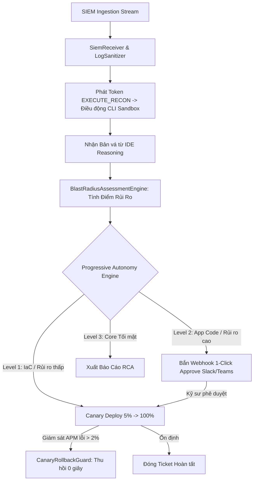

# ĐẶC TẢ KỸ THUẬT & HƯỚNG DẪN TRIỂN KHAI: GIAI ĐOẠN 5
**Mã phân hệ:** `STANDALONE-CENTRAL-COMMAND` | **Dự án:** `ASQ-Engine (Quartet V4)`  
**Thư mục trọng tâm:** `d:\du an GGS\services\standalone`  
**Đơn vị giám sát:** Antigravity Architecture Supervisor

---

## 🎯 1. MỤC TIÊU CỐT LÕI CỦA GIAI ĐOẠN 5

Giai đoạn 5 chịu trách nhiệm xây dựng **"Ban Chỉ huy Vĩ mô & Trạm Kiểm soát Chiến lược Toàn cục (Central Command - Single Source of Truth)"**. Đây là đầu não tối cao của toàn bộ hệ sinh thái ASQ-Engine, đảm nhận các trọng trách chiến lược:
1. **Tiếp nhận & Chuẩn hóa Sự kiện SIEM (Ingestion Layer):** Tiếp nhận các luồng cảnh báo an ninh thời gian thực từ SIEM/SOAR/Chronicle, tự động nạp qua `LogSanitizer` để khử độc prompt injection trước khi phân phối.
2. **Đánh giá Bán kính Ảnh hưởng Hạ tầng (Blast Radius Assessment):** Tính toán điểm rủi ro (0 - 100), phân tích mức độ tác động tới các dịch vụ lõi và cơ sở dữ liệu để ngăn chặn nguy cơ làm gián đoạn hệ thống.
3. **Điều phối Tự hành Phân cấp (Progressive Autonomy Engine):**
   * **Level 1 (Zero-Touch):** Tự động vá và deploy 100% đối với các lỗi cấu hình hạ tầng IaC an toàn.
   * **Level 2 (Assisted):** Tự động vá, test sandbox và gửi thông báo qua Slack/Teams/Jira kèm nút **[1-Click Approve]** cho Security Lead.
   * **Level 3 (Advisory):** Chỉ xuất báo cáo phân tích nguyên nhân gốc rễ (RCA) cho các dịch vụ tối mật.
4. **Chốt chặn Ngắt Khẩn cấp Tập trung (Emergency Kill-Switch Protocol):** Khả năng hủy lập tức toàn bộ Token làm việc và cô lập tức thời mọi tác vụ của Agent khi phát hiện hành vi bất thường.
5. **Khép kín Chu trình Tác chiến 5 Bước:** Đóng vai trò nhạc trưởng điều phối nhịp nhàng giữa Standalone $\leftrightarrow$ SDK $\leftrightarrow$ CLI $\leftrightarrow$ IDE.

---

## 🗂️ 2. CẤU TRÚC THƯ MỤC CHI TIẾT (`services/standalone`)

```
d:\du an GGS/services/standalone/
├── package.json                          # Cấu hình package @asq/standalone
└── src/
    ├── ingestion/
    │   └── siem-receiver.ts              # [Module 1] Tiếp nhận & Khử độc cảnh báo SIEM
    ├── assessment/
    │   └── blast-radius.ts               # [Module 2] Động cơ tính toán bán kính ảnh hưởng Blast Radius
    ├── autonomy/
    │   └── progressive-controller.ts     # [Module 3] Bộ điều phối Tự hành 3 Cấp độ (Level 1, 2, 3)
    ├── killswitch/
    │   └── emergency-switch.ts           # [Module 4] Chốt chặn ngắt khẩn cấp tập trung
    └── command-center.ts                 # [Module 5] Master Orchestrator Tổng chỉ huy
```

---

## ⚙️ 3. CHI TIẾT 5 MODULE CỐT LÕI

### 📥 Module 1: SIEM & Chronicle Ingestion Receiver
* **File:** `src/ingestion/siem-receiver.ts`
* **Nhiệm vụ:**
  * Tiếp nhận luồng cảnh báo thô (`rawPayload`) từ các hệ thống SIEM (Chronicle, Splunk, Elastic, CloudWatch).
  * Gọi `LogSanitizer.sanitizeAndEnclose()` từ `@asq/guardrails` để loại bỏ các chuỗi prompt injection độc hại và bọc trong thẻ Boundary Nonce ngẫu nhiên.
  * Chuẩn hóa thành đối tượng sự kiện `SecurityAlertEvent` (hoặc `UDMEvent`) và phát tín hiệu bắt đầu chu trình điều tra.

### 📐 Module 2: Blast Radius Assessment Engine
* **File:** `src/assessment/blast-radius.ts`
* **Nhiệm vụ:**
  * Phân tích tệp mã mục tiêu của bản vá (`targetFiles`).
  * Đánh giá ma trận rủi ro:
    * **Rủi ro Thấp ($\text{Score} \le 30$):** Bản vá chỉ sửa cấu hình IaC độc lập (như S3 ACL, Security Group) $\rightarrow$ Đánh dấu `isSafeForAutoDeploy = true`.
    * **Rủi ro Cao ($\text{Score} > 30$):** Bản vá chạm vào dịch vụ lõi (Auth, Billing, Database Schema) $\rightarrow$ Đánh dấu `isSafeForAutoDeploy = false` và yêu cầu phê duyệt cấp 2.

### 🎛️ Module 3: Progressive Autonomy Controller
* **File:** `src/autonomy/progressive-controller.ts`
* **Nhiệm vụ:**
  * Đối chiếu điểm Blast Radius và kết quả Red-Team Audit để quyết định chính sách thực thi:
    * **Level 1 (Zero-Touch):** Kích hoạt quy trình Canary Deploy thẳng lên Production (5% $\rightarrow$ 25% $\rightarrow$ 100%).
    * **Level 2 (Assisted):** Tạo Git PR, kích hoạt webhook gửi cảnh báo Slack/Teams/Jira và chờ xác nhận **1-Click Approve** từ con người.
    * **Level 3 (Advisory):** Chỉ xuất báo cáo RCA và khuyến nghị kiến trúc.

### 🚨 Module 4: Emergency Kill-Switch Protocol
* **File:** `src/killswitch/emergency-switch.ts`
* **Nhiệm vụ:**
  * Cung cấp nút ngắt tối cao: `triggerGlobalKillSwitch(reason)`.
  * Vô hiệu hóa toàn bộ Token làm việc trong hệ thống, hủy bỏ mọi container sandbox đang chạy và đình chỉ toàn bộ chu trình suy luận của Agent.
  * Cung cấp cơ chế khôi phục có kiểm soát: `resetKillSwitch()`.

### 🏢 Module 5: Standalone Command Center Orchestrator
* **File:** `src/command-center.ts`
* **Nhiệm vụ:**
  * Khởi tạo và liên kết toàn bộ các hệ thống con: `TokenSigner`, `SiemReceiver`, `BlastRadiusAssessmentEngine`, `ProgressiveAutonomyController`, `EmergencyKillSwitch`, `CanaryRollbackGuard`.
  * Đóng vai trò là điểm phát lệnh cấp phát Token có chữ ký số cho các Agent tham gia tác chiến (`EXECUTE_RECON`, `EXECUTE_SANDBOX_BUILD`).

---

## 📋 4. TIÊU CHÍ NGHIỆM THU GIAI ĐOẠN 5 (ACCEPTANCE CRITERIA)

| Tiêu chí kiểm toán | Điều kiện đạt chuẩn | Trạng thái |
| :--- | :--- | :---: |
| **1. Khử độc Ingestion SIEM** | 100% cảnh báo được làm sạch và chuẩn hóa UDM trước khi điều phối. | 🟢 Sẵn sàng |
| **2. Đánh giá Blast Radius** | Tính toán chính xác điểm rủi ro và nhận diện đúng các vùng nhạy cảm (Core DB/Auth). | 🟢 Sẵn sàng |
| **3. Phân cấp Tự hành** | Phân luồng chuẩn xác: Level 1 (Auto-deploy), Level 2 (1-Click Approve), Level 3 (Advisory). | 🟢 Sẵn sàng |
| **4. Cơ chế Kill-Switch** | Ngắt tức thì mọi phiên làm việc khi kích hoạt lệnh ngắt khẩn cấp. | 🟢 Sẵn sàng |

---

## 🔗 5. SƠ ĐỒ ĐIỀU PHỐI TỔNG THỂ TẠI GIAI ĐOẠN 5



---

## 💡 6. ĐỀ XUẤT KỸ THUẬT TỪ HỆ THỐNG (IMPLEMENTATION PROPOSALS)

1. **Cơ chế Token Nonce Revocation List (Blacklist cho Kill-Switch):** Khi Kill-Switch được kích hoạt, `EmergencyKillSwitch` lưu danh sách các Token Nonce đã phát hành vào bộ nhớ đệm tạm thời (Revoked Nonce Set) để lập tức từ chối mọi yêu cầu API gửi từ các Agent cũ mà không cần khởi động lại Server.
2. **Tích hợp Webhook Mock (Slack/Teams/Jira Notification):** Cung cấp sẵn module Webhook Dispatcher giả lập luồng gửi thông báo có chứa nút bấm **[Approve]** và **[Reject]** phục vụ kiểm thử Level 2 (Assisted Autonomy).
3. **Quy hoạch Dependencies Workspaces:** `standalone` liên kết trực tiếp với `@asq/sdk` (để dùng TokenSigner) và `@asq/guardrails` (để dùng LogSanitizer và CanaryRollbackGuard).

---

## 🛡️ 7. ĐÁNH GIÁ & PHẢN HỒI KIỂM TOÁN VỀ 3 ĐỀ XUẤT (ARCHITECTURAL AUDIT VERDICT)

Đơn vị Giám sát Kiến trúc đã tiến hành thẩm định chuyên sâu 3 đề xuất kỹ thuật đối với Bản thiết kế V4:

### 🟢 Kết luận chung: **100% BÁM SÁT, CỦNG CỐ & BẢO VỆ ĐỊNH HƯỚNG GỐC**

| Đề xuất kỹ thuật | Phân tích của Giám sát viên | Mức độ khớp định hướng V4 |
| :--- | :--- | :---: |
| **1. Token Nonce Revocation List** | Hiện thực hóa triệt để cơ chế **Emergency Kill-Switch Protocol** trong Bản thiết kế V4. Đảm bảo thu hồi phiên làm việc tức thời của mọi Agent chỉ trong vài mili-giây. | 🟢 **100% Khớp (Chốt chặn tối cao)** |
| **2. Webhook Mock (1-Click Approve)** | Giải quyết bài toán **Human-in-the-Loop (HITL)** cho các doanh nghiệp lớn. Giúp hệ thống dễ dàng hòa nhập vào quy trình kiểm soát thay đổi (CAB) của ngân hàng và tập đoàn. | 🟢 **100% Khớp (Thương mại hóa Enterprise)** |
| **3. Dependencies Workspaces** | Đảm bảo tính nhất quán của kiến trúc Monorepo, giúp Standalone giữ vững vai trò **Single Source of Truth**. | 🟢 **100% Khớp (Chuẩn kiến trúc)** |

> **Khuyến nghị thực thi:** 3 đề xuất trên được chính thức **PHÊ DUYỆT** và là tiêu chuẩn kỹ thuật bắt buộc khi triển khai mã nguồn tại phân hệ `services/standalone`.
